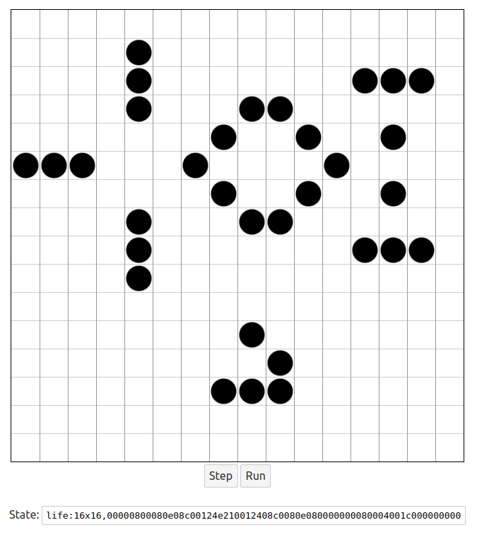

# Game of Life in Svelte

This is a very basic implementation of [Conway's Game of Life](https://en.wikipedia.org/wiki/Conway%27s_Game_of_Life) that I made partly as a testbed for other experiments, and also to brush up on [Svelte](https://svelte.dev/) and other web technologies.



You can edit the board and run it forward. It also has a way to save and load states from a string that encodes the size of the board and its state. (For instance, the state of the board above is encoded by `life:16x16,00000800080e08c00124e210012408c0080e080000000080004001c000000000`.)

To run it, with Svelte installed, go to the project directory and type:
```
$ npm run dev
```

This will run the page at http://localhost:5000 by default.
